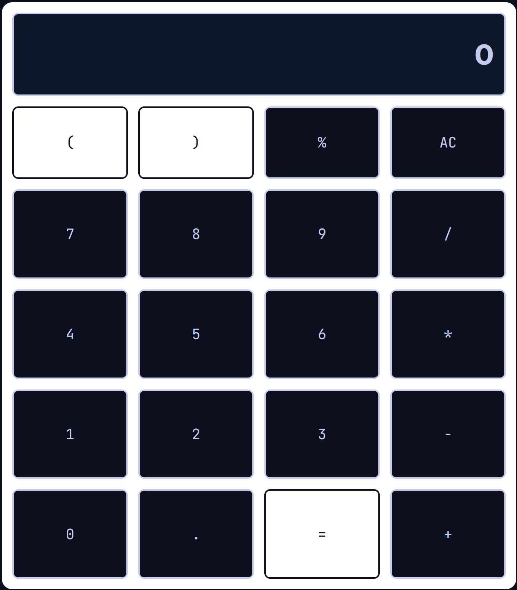

# CalculatorWebApp

## Overview
This is a straightforward web app for basic arithmetic calculations. 

## Features
- **Clean Interface:** Simple design for quick calculations.
- **Basic Operations:** Addition, subtraction, multiplication, and division. 

- **Responsive Design:** Works well on different screen sizes.

## How to Use
1. **Access the Web App:** Visit [Calculator Web App](#) to start using it.
2. **Input Numbers:** Use the on-screen keypad or your keyboard. 
3. **Select Operation:** Click on the operation button (addition, subtraction, multiplication, division). 
4. **View Results:** The result will be displayed on the screen.

## Screenshots

## Technologies
- HTML5
- CSS3
- JavaScript

## Future Plans
This project is ongoing, and future plans may include:
- Adding functionality to the calculator
